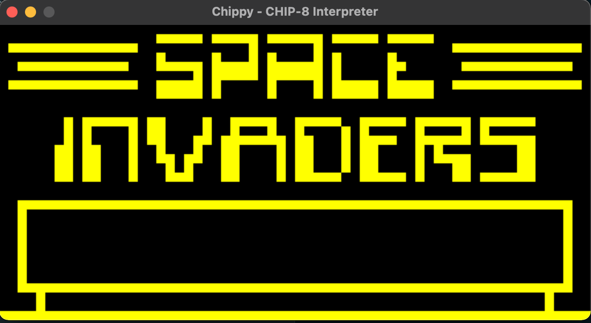
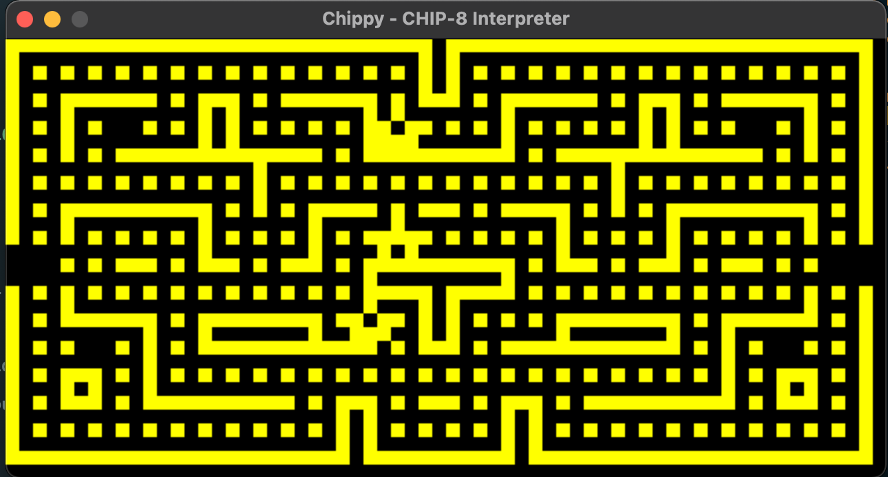

# chippy

CHIP-8 Interpreter written in Rust.

# Usage

You'll definitely need to install the [SDL2.0 Development Libraries](https://www.libsdl.org/). I'd suggest for you to check [rust-sdl2](https://github.com/Rust-SDL2/rust-sdl2)'s README, since it covers scenarios that may be relevant to you. Once you have SDL2 installed, you can simply run:

```bash
$ cargo run -- games/<GAME>
```

You should replace `<GAME>` with whatever game tickles your fancy. The games under `games/` are [public domain](https://www.zophar.net/pdroms/chip8/chip-8-games-pack.html).

# Testing

Working on it.

# Screenshots

## Space Invaders


## Blinky


# References
- [CHIP-8 Games Pack](https://www.zophar.net/pdroms/chip8/chip-8-games-pack.html)
- [Cowgod's Chip-8 Technical Reference v1.0](http://devernay.free.fr/hacks/chip8/C8TECH10.HTM)
- [Matthew Mikolay's CHIP-8 Technical Reference](https://github.com/mattmikolay/chip-8/wiki/CHIP%E2%80%908-Technical-Reference)
- [Collection of CHIP-8 related documentation](https://github.com/trapexit/chip-8_documentation)
- [Awesome CHIP-8](https://chip-8.github.io/links/)

And here is a list of some of the projects that I've read and used as a source of inspiration. I didn't copy any of the code, but some names may be exactly the same simply because there was no better alternative.

- [Laurence Muller's CHIP-8 emulator in C++](https://multigesture.net/articles/how-to-write-an-emulator-chip-8-interpreter/)
- [Steve Losh's CHIP-8 emulator in Common Lisp](https://github.com/sjl/cl-chip8)
- [Starr Horne's CHIP-8 emulator in Rust](https://github.com/starrhorne/chip8-rust)
- [Michael Burge's NES emulator in Rust](https://github.com/MichaelBurge/nes-emulator)
- [Imran Nazar's GameBoy emulator in JavaScript](https://github.com/Two9A/jsGB)
